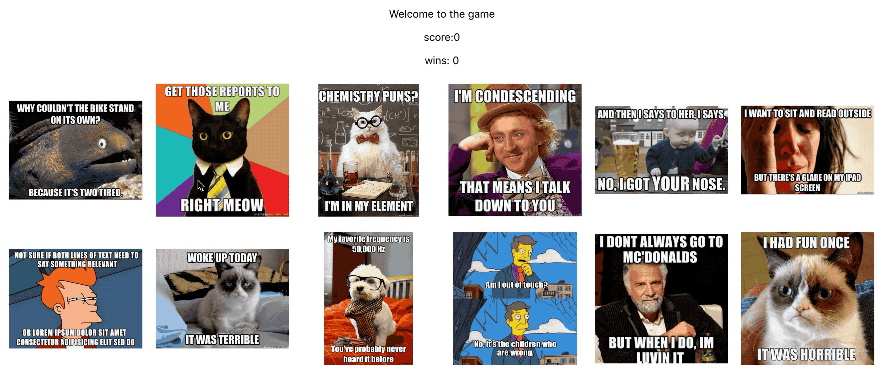
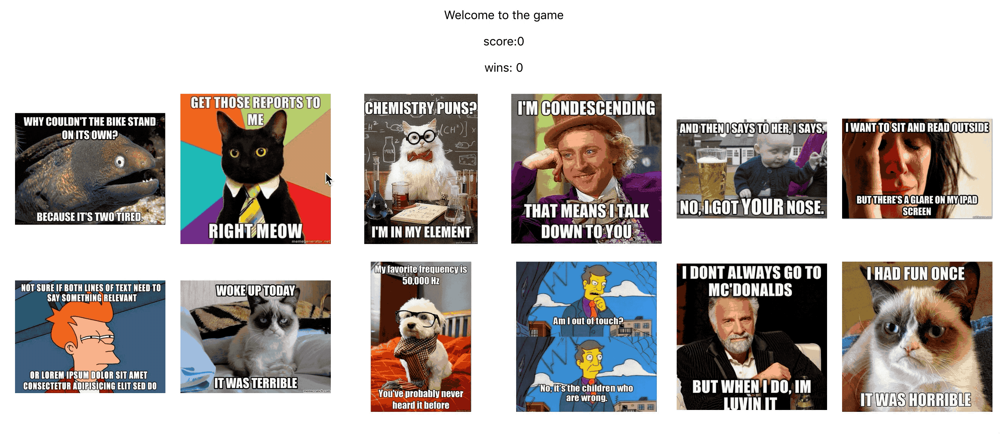
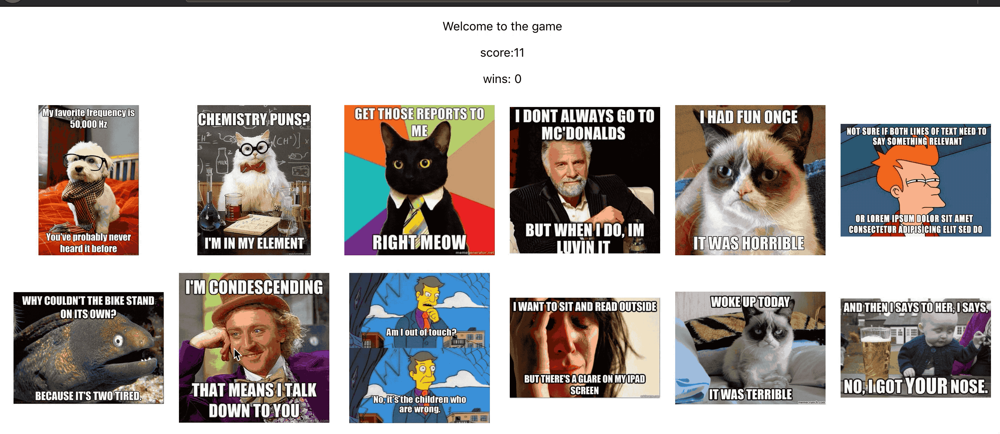

This is a memory game built with react. In the game, players get points for clicking a new meme, but lose if they click on a meme they've already selected.

Each time a player clicks a new meme, they get a point:

If players click the same meme twice before winning the round, they lose and the game restarts:

If players click all twelve memes without repeating themselves, they win

